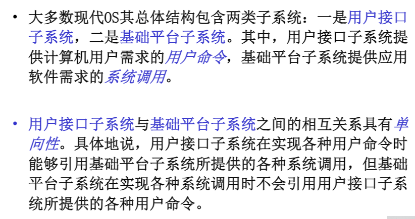
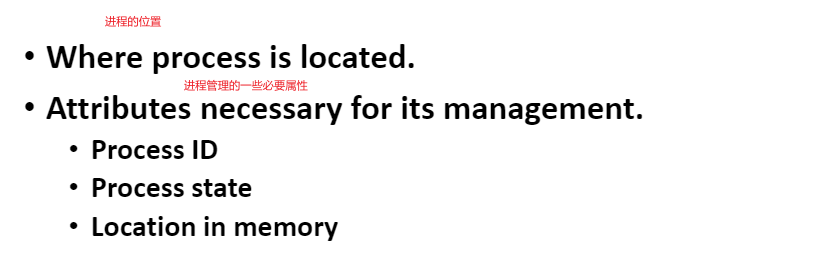
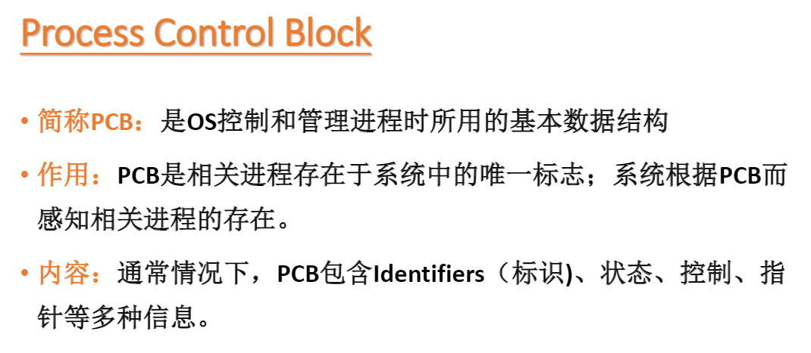

# OS

### 1.OS演变过程(单机)

1. 无操作系统(串行处理)

   >- 人工操作----------------人工装入任务,运行完毕后,只有取走任务结果,下个任务才能执行.
   >- 脱机输入/输出方式--------------------脱机,将运行的结果打印到纸带上,直接开始下一个任务,结果已经持久化了.

2. 单道批处理系统

   >将一堆作业放在**disk**(磁盘)上的**批处理队列**,用户不再干预,由系统中的Monitor一次从**disk**调入一个任务到内存中执行,任务独享整个主存
   >
   >缺点: 吞吐量小,CPU的利用率低,任务处于I/O等非计算状态时,CPU空闲

3. 多道批处理系统

   >把一堆作业提前放在**disk**上的**批处理队列**,用户不在干预,由Monitor**进行作业调度选择若干作业**到内存中并为之创建进程,然后调度运行,多个任务共享CPU和内存资源等
   >
   >缺点:无交互能力,任务交给操作系统后,人工不能干预

4. 分时系统

   >**多作业不用提前放在disk而是直接进入内存**,方便多用户可以在终端输入数据对自己的任务做出修改,每个任务占有CPU的时间由**时间片**决定,多个任务共享CPU和内存资源等

其他功能的OS:

1. 实时系统

   >必须对所接收的某些信号做出""及时"或"实时"的反应

------

### 2.OS总体结构




#### 2.1.OS基础平台子系统风格

##### 2.1.1.分层方式:

1. 分层

   >上层只依赖**直接下层**

2. 分级

   >上层只依赖**下层**

3. 分块

   >所有模块都可**任意引用其他模块**


##### 2.1.2.分模式方式:

1. 多模式

   >包含多个模式模块,其由应用软件,基础平台子系统组成.不同的模式模块在不同的CPU特权下执行
   >
   >主要处于安全考虑,不同的app运行在可能不同的级别的保护模式下,需要切换,和安全判断

2. 单模式

   >应用软件,基础平台子系统在同一个CPU特权下执行
   >
   >实例:DOS  app和os在同一模式下,不需要切换,在封闭无网络的情况下,效率高

   

3. 双模式

   >俗称用户态和内核态
   >
   >实例:linux

##### 2.1.3.微内核

```
尽最大努力剔除核心子系统中多余的部分,并把它们移到核外子系统中实现,核心子系统只实现一些必要的简单概念及其属性,从而保持核心子系统简洁高效
实例:分布式OS鸿蒙
```

------

### 3.OS资源管理


#### 3.1.Memory Tables


#### 3.2.I/O Tables


#### 3.3.File Tables


#### 3.4.Processes Tables



------


------


------

### 4.OS进程

#### 4.1.七状态转换图(状态都在PCB中)


- Suspend(挂起):

>**原因**:CPU的速度远超I/O的速度,所以可能全部的进程都在等待I/O,为了腾出更多的memory,采用swap将暂时不能运行的进程或数据交换到disk上,进程状态变为Supend,**但是PCB还在内存**
>
>**造成Suspend情况**:
>
>1. OS的周期性的检查进程,在周期未到达时,处于挂起状态
>2. 用户debug某个正在运行的进程
>3. 时钟中断
>4. 父进程请求子进程挂起,以便考察和修改子进程，或者协调各子进程间的活动


- Blocked和Suspend区别:


- **当进程就绪队列为空时:**


------


#### 4.2.PCB里面的信息



------


------


------


------


------


------


------


------


------


------

#### 4.3.原语

>若干条指令组成的程序段，用来实现某个特定功能，在执行过程中不可被中断,可以看成原子操作

以下进程的状态的切换都是由原语完成:


##### 模式切换

>app触发系统调用,会触发**软中断**(判断此次调用是否合法,是否有足够的权限),进而从用户态切换到内核态去执行相应的系统函数
>
>模式切换**可能**会造成进程切换

##### 4.3.1.进程切换

>收回当前进程的cpu,准备把它分派给某个就绪的进程
>
>进程切换**必然**会造成模式切换(**需要通过模式切换到内核态,运行进程的调度程序**)

进程切换的步骤:


##### 4.3.2.进程创建

触发条件:


进程创建步骤:


##### 4.3.3.进程终止

触发条件:


触发原因:


进程终止步骤:


##### 4.3.4.进程阻塞与唤醒

阻塞触发条件:


##### 4.3.5.进程挂起与激活

挂起触发条件:

>1. OS的周期性的检查进程,在周期未到达时,处于挂起状态
>2. 用户debug某个正在运行的进程
>3. 时钟中断
>4. 父进程请求子进程挂起,以便考察和修改子进程，或者协调各子进程间的活动


### 5.OS线程

>同一个进程的多个线程共享进程的资源,是调度基本单位

线程优点:


注意:

- 挂起一个进程,该进程内的所有线程也被挂起,原因:进程里面的所有线程共享相同的地址空间
- 终止一个进程,该进程内的所有线程也终止

#### 5.1.不同OS对线程的支持:

1. DOS:单线程
2. Unix:多用户多进程+多线程
3. linux:多用户单进程(init)+多线程
4. windows:单进程+多线程

#### 5.2.线程分类:

1. 用户线程: 用户态的线程,kernel不知道有多少个用户线程,没有TCB(线程的控制块),不归它调度
2. 内核线程:内核态的线程,由内核调度,有更高的访问权限

#### 5.3.用户线程和内核线程三种对应模型


### 6.OS进程调度

#### 6.1.调度的三种类型

1. Long-term scheduling(长程调度)

   >在批处理系统中,作业进入系统后,先驻留在disk上的批处理队列,Long-term scheduling从该队列中选择作业,并为之创建进程分配资源,插入到就绪队列,等待Medium-term scheduling

2. Medium-term scheduling(中程调度) 

   >从外存(disk)选择一个被挂起的进程,将其调入到内存

3. Short-term scheduling(短程调度) 

   >调度内存中的就绪队列的进程执行


#### 6.2.调度算法

1. 剥夺式(抢占式)调度算法:

   - RR(Round Robin) 时间片轮转

     >每次从就绪队列队首选出一个进程执行一个时间片(如30 ms)的时间,然后产出中断,切换进程;
     >
     >若时间片没有消耗完,进程已经运行完毕,就产生中断激活调度程序进程,将运行完毕的进程从就绪队列删除,再从就绪队列队首挑选一个进程调度运行
     >
     >若时间片消耗完,进程还没运行完毕,则产生中断激活调度程序进程,将该进程移到就绪队列末尾,再从就绪队列队首挑选一个进程调度运行

     算法分析:

     

     ------

     

   - VRR(Virtual Round Robin) 

     >在RR的过程下,增加一个辅助队列,接收I/O阻塞完成的进程,调度程序优先调度这个队列的进程,但是对于该队列的进程的时间片要比就绪队列的时间片要小

     算法分析:

     

     ------

     

   - FB(Feebback) 反馈调度算法

     >1. 设置多个就绪队列.各个队列的优先级别不同(从上而下优先级逐级降低)
     >
     >2. 各个队列中进程执行的时间片不同,优先级越高的时间片越短
     >
     >3. 新进程首先放入第一队列,按照FCFS的方法调度,若一个时间片未完成,到下一队列排队等待
     >
     >4. 仅当第一队列空时,调度程序才开始调度第二队列的进程,以此类推~
     >
     >   

     算法分析:

     

     ------

     

2. 非剥夺式(抢占式)调度算法:

   - FCFS(First Come First Served) 先来先服务

     >所有的进程都按就绪队列的顺序执行

     算法分析:

     

   - SPN(Shortest Process Next) 短进程优先

     >消耗时间短的进程先执行

     算法分析:

     

   - SRT(Shortest Remaining Time) 剩余时间短者优先

     >剩余时间短的进程先执行

     算法分析:

     

   - HRRN(Highest Response Ratio Next) 响应比高者优先

     

     >RR(响应比)=1+等待时间/要求服务的时间

     算法分析:

     

#### 6.3.实时调度算法

1. EDF(Earliest Deadline First): 最早截止时间优先

   >截止时间越早的任务,越靠近就绪队列队首,优先级越高

   EDF分为抢占式和非抢占式:

   - 非抢占式: FCFS调度就绪队列的任务(**适用于非周期实时任务**)
   - 抢占式: 优先级高的先执行(**适用于周期实时任务**)

2. LLF(Least Laxity First) :最低松弛度优先

   >A(松弛度)=必须完成时间-运行了的时间-当前时间
   >
   >抢占式,谁的优先级高谁来

### 7.进程并发

### 8.死锁与饥饿

### 9.存储管理

#### 9.1.简单内存管理

```
简单内存管理:所有的进程的数据全部加载到内存空间
```

又可细分为两类:

>连续管理方式:
>
>1. 分区
>
>   - 固定分区
>
>     >系统启动时将内存划分为**数目固定,尺寸固定**的多个分区
>     >
>     >**缺点**:有可能进程对一个分区的内存只占用一部分,但是由于固定分区,不可更改,别的进程不能利用这部分内存,会产生**[内零头](https://blog.csdn.net/baidu_37964071/article/details/81069762)**的浪费
>
>   - 动态分区
>
>     >进程需要多大的内存就分配多少,即分区的大小
>     >
>     >**缺点**:会导致主存因为动态分区导致有些小块内存分不出去,用不了,造成[外零头](https://blog.csdn.net/baidu_37964071/article/details/81069762)的浪费,此时会诞生Compaction**内存整理**的操作,把小块内存合并成大块内存
>
>   **采用分区方式的寻址过程:**
>
>   
>
>离散管理方式:
>
>1. 分页
>
>   >主存被划分为固定大小的页框(物理硬件划分),并标号
>   >
>   >进程也被划分成大小相等的页,每个进程都有一个页表,存储了:页号(进程的)+页框号(物理内存的)
>   >
>   >通过逻辑地址变换物理地址的步骤:
>   >
>   >1. 根据逻辑地址以及页大小求出页号和页内偏移
>   >2. 在页表中,用页号检索对应的页框号
>   >3. 根据页框号+页内偏移+页框尺寸求出物理地址
>   >
>   >
>   >
>   >**面临问题**: 当一个进程特别大,导致页表特别大,一个页表装不下,出现**多级页表**;
>
>2. 分段
>
>   >基于模块化程序设计,我们将进程分成大小不同的segment段,系统将物理内存动态分区,当进程装入物理内存时,系统会为进程的每个段独立的分配一个对应大小的区,多个段的分区不连续
>   >
>   >每个进程的pcb中还维护着一个**段表**(段号+段的物理起始地址(主存分区的起始地址)+段长度)
>   >
>   >通过逻辑地址变换物理地址的步骤:
>   >
>   >1. 以逻辑地址中的**段号**为索引检索段表,得到对应的段表项
>   >2. 若逻辑地址中的**段内偏移**大于段表项的**段长度**,则产生**存储保护中断**
>   >3. 否则,将逻辑地址中的段内偏移+分区的起始物理地址,即物理地址
>   >
>   >
>
>3. 分段+分页
>
>   >

#### 9.2.虚拟内存管理

```
虚拟内存管理:每个进程的数据用到什么就加载什么,只加载一部分到主存
```

> 虚拟内存对分页的改进:
>
> 1. 如果当前正在运行的进程需要用到的页不在内存,**缺页中断**(进程由于I/O,状态变为阻塞),cpu给I/O设备发送命令从disk中load数据到内存
>    - 如果进程分配的页框没占满,直接从disk将页load到内存; 
>    - 如果进程分配的页框占满了,可以选择该进程的暂时用不到的页框换出内存,将我们需要的页换入内存(**页面置换算法**);
> 2. 给页表加一个cache,即快表(TLB)
>
> 


------

# Linux OS


### 僵尸进程

​	父进程产生子进程后,会维护子进程的一个PCB结构,子进程退出,由父进程释放,

如果父进程没有释放,那么子进程会成为一个僵尸进程

```shell
ps -ef | grep defuct
```

### 孤儿进程

​	子进程结束之前,父进程已经退出.孤儿进程会成为init进程的孩子,由1号进程维护

### 进程调度方式

1. 非抢占式: 	一旦把处理机分配给某进程后,就一直让他运行下去,绝不会因为时钟中断或任何其他原因去抢占当前正在运行的处理机,直至该进程完成,或发生某事件而被阻塞时,才把处理机分配给其他进程.
2. 抢占式:         允许调度程序根据某种原则,去暂停某个正在执行的进程,将已经分配给该进程的处理机重新分配给另一进程.

### linux进程调度算法

1. linux2.5 经典的O(1)调度策略,**每个进程轮询的给固定的时间片**

   **缺点**:偏向服务器,对交互不友好(有些进程可能不需要处理机了,但是还被分配了时间片,导致正真需要时间片进程没能及时得到时间片)

2. linux 2.6.23 采用CFS完全公平的调度算法:**按优先级分配时间片的比例,记录每个进程的执行时间,如果有一个进程执行时间不到它应该分配的比例,该进程优先执行**

### 进程类型

- IO密集型:大部分时间用于等待IO
- CPU密集型:大部分时间用于计算

### 进程优先级

实时进程(0~99级)>普通进程(-20-99)

值越小优先级越高

### 默认的调度策略

对于实时进程:

> **优先级不同**FIFO(谁优先级高谁先进,先进先出),**优先级相同**的RR(轮询)

对于普通进程:

> 上面的CFS

### 内存管理

#### 多个进程装入内存导致的问题:

- 内存大小不够用:**分页(用哪部分加载哪部分)**  + LRU(最不经常使用内存置换算法)**置换出来的数据放在swap交换分区的硬盘里**

- **进程间相互干扰**+**直接操作物理内存不安全**:

  > 虚拟内存:
  >
  > ​	让进程工作在虚拟空间,程序中用到的空间地址不再是直接的物理地址,而是虚拟地址,这样,A进程永远不可能访问到B进程的空间,虚拟内存比物理空间大很多,64位操作系统的虚拟空间2^64bit,由于虚拟空间被分成不同的段,我们的进程需要使用的内存也会分布到虚拟内存的不同的段中.所以,在虚拟的角度进程独享整个系统+CPU
  
  


#### 虚拟内存到物理内存的映射问题:

1. 偏移量+段的基地址=线性地址(虚拟空间)
2. 线性地址+OS+MMU(内存管理单元)=物理地址


