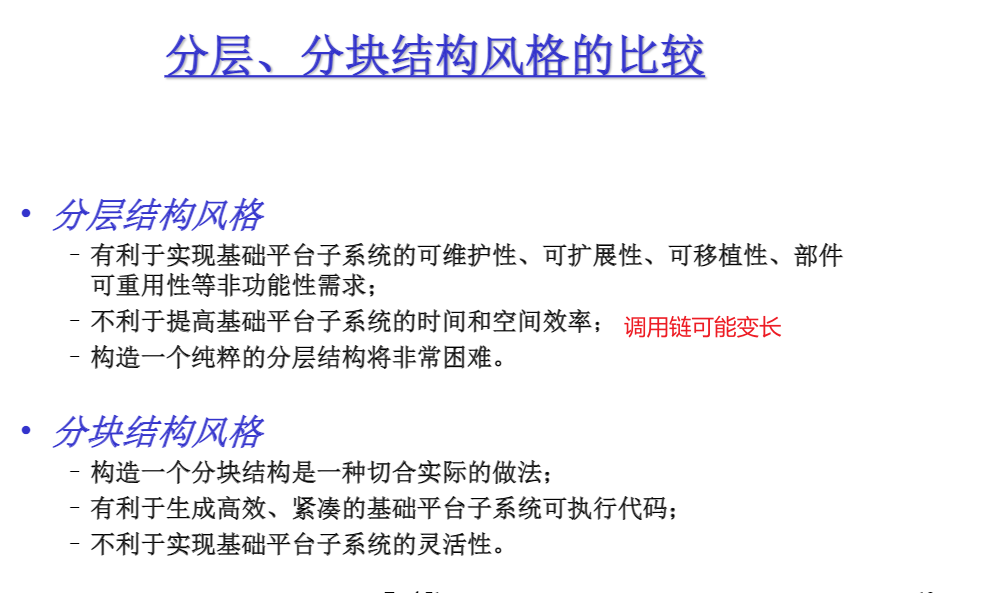

# OS

### OS演变过程(单机)

1. 无操作系统(串行处理)

   >- 人工操作----------------人工装入任务,运行完毕后,只有取走任务结果,下个任务才能执行.
   >- 脱机输入/输出方式--------------------脱机,将运行的结果打印到纸带上,直接开始下一个任务,结果已经持久化了.

2. 单道批处理系统

   >将一堆任务放在**disk**(磁盘)上,用户不再干预,由系统中的Monitor一次从disk调入一个任务到内存中执行,任务独享整个主存
   >
   >缺点: 吞吐量小,CPU的利用率低,任务处于I/O等非计算状态时,CPU空闲

3. 多道批处理系统

   >把一堆任务提前放在**外存**的"等待队列",由Monitor从后备队列中**选择若干作业**到内存中运行,多个任务共享CPU和内存资源等
   >
   >缺点:无交互能力,任务交给操作系统后,人工不能干预

4. 分时系统

   >**多任务直接进入内存**,方便多用户可以在终端输入数据对自己的任务做出修改,每个任务占有CPU的时间由**时间片**决定,多个任务共享CPU和内存资源等

其他功能的OS:

1. 实时系统

   >必须对所接收的某些信号做出""及时"或"实时"的反应

### OS总体结构


#### OS基础平台子系统风格

##### 分层方式:

1. 分层

   >上层只依赖**直接下层**

2. 分级

   >上层只依赖**下层**

3. 分块

   >所有模块都可**任意引用其他模块**



##### 分模式方式:

1. 多模式

   >包含多个模式模块,其由应用软件,基础平台子系统组成.不同的模式模块在不同的CPU特权下执行
   >
   >主要处于安全考虑,不同的app运行在可能不同的级别的保护模式下,需要切换,和安全判断

2. 单模式

   >应用软件,础平台子系统在同一个CPU特权下执行
   >
   >实例:DOS  app和os在同一模式下,不需要切换,在封闭无网络的情况下,效率高

   

3. 双模式

   >俗称用户态和内核态
   >
   >实例:linux

##### 微内核

```
尽最大努力剔除核心子系统中多余的部分,并把它们移到核外子系统中实现,核心子系统只实现一些必要的简单概念及其属性,从而保持核心子系统简洁高效
实例:分布式OS鸿蒙
```


------

# Linux OS


### 僵尸进程

​	父进程产生子进程后,会维护子进程的一个PCB结构,子进程退出,由父进程释放,

如果父进程没有释放,那么子进程会成为一个僵尸进程

```shell
ps -ef | grep defuct
```

### 孤儿进程

​	子进程结束之前,父进程已经退出.孤儿进程会成为init进程的孩子,由1号进程维护

### 进程调度方式

1. 非抢占式: 	一旦把处理机分配给某进程后,就一直让他运行下去,绝不会因为时钟中断或任何其他原因去抢占当前正在运行的处理机,直至该进程完成,或发生某事件而被阻塞时,才把处理机分配给其他进程.
2. 抢占式:         允许调度程序根据某种原则,去暂停某个正在执行的进程,将已经分配给该进程的处理机重新分配给另一进程.

### linux进程调度算法

1. linux2.5 经典的O(1)调度策略,**每个进程轮询的给固定的时间片**

   **缺点**:偏向服务器,对交互不友好(有些进程可能不需要处理机了,但是还被分配了时间片,导致正真需要时间片进程没能及时得到时间片)

2. linux 2.6.23 采用CFS完全公平的调度算法:**按优先级分配时间片的比例,记录每个进程的执行时间,如果有一个进程执行时间不到它应该分配的比例,该进程优先执行**

### 进程类型

- IO密集型:大部分时间用于等待IO
- CPU密集型:大部分时间用于计算

### 进程优先级

实时进程(0~99级)>普通进程(-20-99)

值越小优先级越高

### 默认的调度策略

对于实时进程:

> **优先级不同**FIFO(谁优先级高谁先进,先进先出),**优先级相同**的RR(轮询)

对于普通进程:

> 上面的CFS

### 内存管理

#### 多个进程装入内存导致的问题:

- 内存大小不够用:**分页(用哪部分加载哪部分)**  + LRU(最不经常使用内存置换算法)**置换出来的数据放在swap交换分区的硬盘里**

- **进程间相互干扰**+**直接操作物理内存不安全**:

  > 虚拟内存:
  >
  > ​	让进程工作在虚拟空间,程序中用到的空间地址不再是直接的物理地址,而是虚拟地址,这样,A进程永远不可能访问到B进程的空间,虚拟内存比物理空间大很多,64位操作系统的虚拟空间2^64bit,由于虚拟空间被分成不同的段,我们的进程需要使用的内存也会分布到虚拟内存的不同的段中.所以,在虚拟的角度进程独享整个系统+CPU
  
  


#### 虚拟内存到物理内存的映射问题:

1. 偏移量+段的基地址=线性地址(虚拟空间)
2. 线性地址+OS+MMU(内存管理单元)=物理地址


