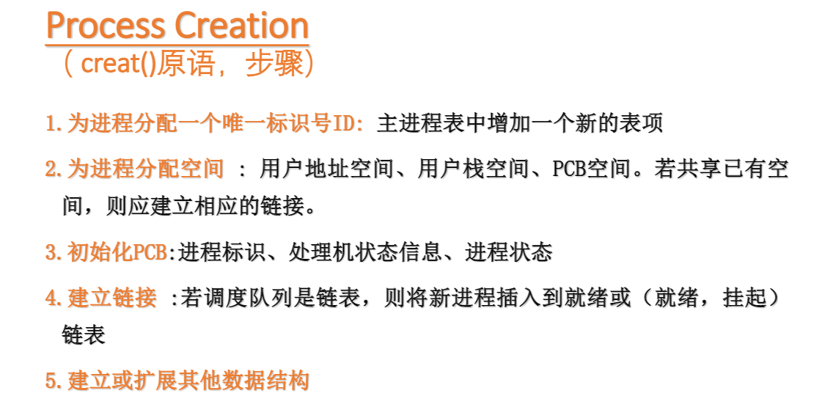
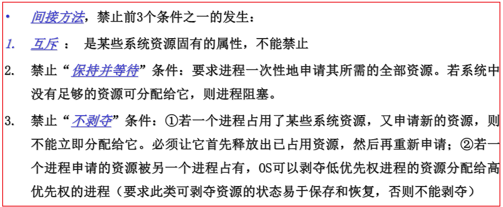
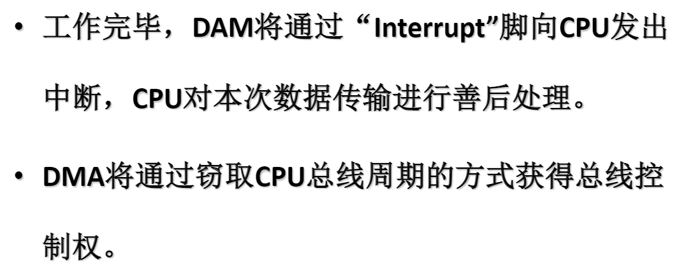
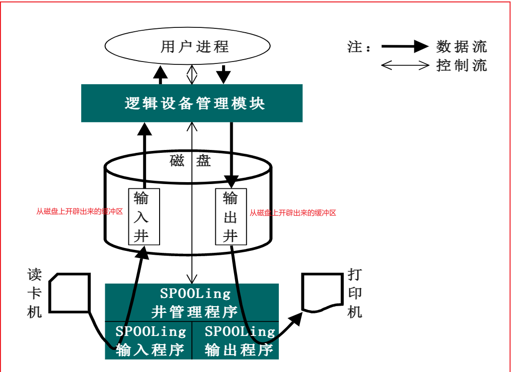
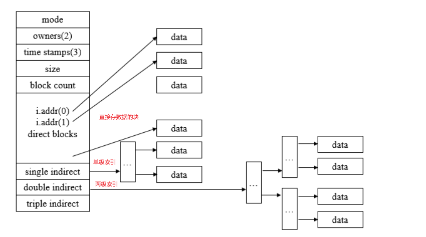

# OS

### 1.OS演变过程(单机)

1. 无操作系统(串行处理)

   >- 人工操作----------------人工装入任务,运行完毕后,只有取走任务结果,下个任务才能执行.
   >- 脱机输入/输出方式--------------------脱机,将运行的结果打印到纸带上,直接开始下一个任务,结果已经持久化了.

2. 单道批处理系统

   >将一堆作业放在**disk**(磁盘)上的**批处理队列**,用户不再干预,由系统中的Monitor一次从**disk**调入一个任务到内存中执行,任务独享整个主存
   >
   >缺点: 吞吐量小,CPU的利用率低,任务处于I/O等非计算状态时,CPU空闲

3. 多道批处理系统

   >把一堆作业提前放在**disk**上的**批处理队列**,用户不在干预,由Monitor**进行作业调度选择若干作业**到内存中并为之创建进程,然后调度运行,多个任务共享CPU和内存资源等
   >
   >缺点:无交互能力,任务交给操作系统后,人工不能干预

4. 分时系统

   >**多作业不用提前放在disk而是直接进入内存**,方便多用户可以在终端输入数据对自己的任务做出修改,每个任务占有CPU的时间由**时间片**决定,多个任务共享CPU和内存资源等

其他功能的OS:

1. 实时系统

   >必须对所接收的某些信号做出""及时"或"实时"的反应

------

### 2.OS总体结构


#### 2.1.OS基础平台子系统风格

##### 2.1.1.分层方式:

1. 分层

   >上层只依赖**直接下层**

2. 分级

   >上层只依赖**下层**

3. 分块

   >所有模块都可**任意引用其他模块**


##### 2.1.2.分模式方式:

1. 多模式

   >包含多个模式模块,其由应用软件,基础平台子系统组成.不同的模式模块在不同的CPU特权下执行
   >
   >主要处于安全考虑,不同的app运行在可能不同的级别的保护模式下,需要切换,和安全判断

2. 单模式

   >应用软件,基础平台子系统在同一个CPU特权下执行
   >
   >实例:DOS  app和os在同一模式下,不需要切换,在封闭无网络的情况下,效率高

   

3. 双模式

   >俗称用户态和内核态
   >
   >实例:linux

##### 2.1.3.微内核

```
尽最大努力剔除核心子系统中多余的部分,并把它们移到核外子系统中实现,核心子系统只实现一些必要的简单概念及其属性,从而保持核心子系统简洁高效
实例:分布式OS鸿蒙
```

------

### 3.OS资源管理


#### 3.1.Memory Tables


#### 3.2.I/O Tables


#### 3.3.File Tables


#### 3.4.Processes Tables


------


------


------

### 4.OS进程

#### 4.1.七状态转换图(状态都在PCB中)


- Suspend(挂起):

>**原因**:CPU的速度远超I/O的速度,所以可能全部的进程都在等待I/O,为了腾出更多的memory,采用swap将暂时不能运行的进程或数据交换到disk上,进程状态变为Supend,**但是PCB还在内存**
>
>**造成Suspend情况**:
>
>1. OS的周期性的检查进程,在周期未到达时,处于挂起状态
>2. 用户debug某个正在运行的进程
>3. 时钟中断
>4. 父进程请求子进程挂起,以便考察和修改子进程，或者协调各子进程间的活动


- Blocked和Suspend区别:


- **当进程就绪队列为空时:**


------


#### 4.2.PCB里面的信息


------


------


------


------


------


------


------


------


------


------

#### 4.3.原语

>若干条指令组成的程序段，用来实现某个特定功能，在执行过程中不可被中断,可以看成原子操作

以下进程的状态的切换都是由原语完成:


##### 模式切换

>app触发系统调用,会触发**软中断**(判断此次调用是否合法,是否有足够的权限),进而从用户态切换到内核态去执行相应的系统函数
>
>模式切换**可能**会造成进程切换

##### 4.3.1.进程切换

>收回当前进程的cpu,准备把它分派给某个就绪的进程
>
>进程切换**必然**会造成模式切换(**需要通过模式切换到内核态,运行进程的调度程序**)

进程切换的步骤:


##### 4.3.2.进程创建

触发条件:


进程创建步骤:



##### 4.3.3.进程终止

触发条件:


触发原因:


进程终止步骤:


##### 4.3.4.进程阻塞与唤醒

阻塞触发条件:


##### 4.3.5.进程挂起与激活

挂起触发条件:

>1. OS的周期性的检查进程,在周期未到达时,处于挂起状态
>2. 用户debug某个正在运行的进程
>3. 时钟中断
>4. 父进程请求子进程挂起,以便考察和修改子进程，或者协调各子进程间的活动


### 5.OS线程

>同一个进程的多个线程共享进程的资源,是调度基本单位

线程优点:


注意:

- 挂起一个进程,该进程内的所有线程也被挂起,原因:进程里面的所有线程共享相同的地址空间
- 终止一个进程,该进程内的所有线程也终止

#### 5.1.不同OS对线程的支持:

1. DOS:单线程
2. Unix:多用户多进程+多线程
3. linux:多用户单进程(init)+多线程
4. windows:单进程+多线程

#### 5.2.线程分类:

1. 用户线程: 用户态的线程,kernel不知道有多少个用户线程,没有TCB(线程的控制块),不归它调度
2. 内核线程:内核态的线程,由内核调度,有更高的访问权限

#### 5.3.用户线程和内核线程三种对应模型


### 6.OS进程调度

#### 6.1.调度的三种类型

1. Long-term scheduling(长程调度)

   >在批处理系统中,作业进入系统后,先驻留在disk上的批处理队列,Long-term scheduling从该队列中选择作业,并为之创建进程分配资源,插入到就绪队列,等待Medium-term scheduling

2. Medium-term scheduling(中程调度) 

   >从外存(disk)选择一个被挂起的进程,将其调入到内存

3. Short-term scheduling(短程调度) 

   >调度内存中的就绪队列的进程执行


#### 6.2.调度算法

1. 剥夺式(抢占式)调度算法:

   - RR(Round Robin) 时间片轮转

     >每次从就绪队列队首选出一个进程执行一个时间片(如30 ms)的时间,然后产出中断,切换进程;
     >
     >若时间片没有消耗完,进程已经运行完毕,就产生中断激活调度程序进程,将运行完毕的进程从就绪队列删除,再从就绪队列队首挑选一个进程调度运行
     >
     >若时间片消耗完,进程还没运行完毕,则产生中断激活调度程序进程,将该进程移到就绪队列末尾,再从就绪队列队首挑选一个进程调度运行

     算法分析:

     

     ------

     

   - VRR(Virtual Round Robin) 

     >在RR的过程下,增加一个辅助队列,接收I/O阻塞完成的进程,调度程序优先调度这个队列的进程,但是对于该队列的进程的时间片要比就绪队列的时间片要小

     算法分析:

     

     ------

     

   - FB(Feebback) 反馈调度算法

     >1. 设置多个就绪队列.各个队列的优先级别不同(从上而下优先级逐级降低)
     >
     >2. 各个队列中进程执行的时间片不同,优先级越高的时间片越短
     >
     >3. 新进程首先放入第一队列,按照FCFS的方法调度,若一个时间片未完成,到下一队列排队等待
     >
     >4. 仅当第一队列空时,调度程序才开始调度第二队列的进程,以此类推~
     >
     >   

     算法分析:

     

     ------

     

2. 非剥夺式(抢占式)调度算法:

   - FCFS(First Come First Served) 先来先服务

     >所有的进程都按就绪队列的顺序执行

     算法分析:

     

   - SPN(Shortest Process Next) 短进程优先

     >消耗时间短的进程先执行

     算法分析:

     

   - SRT(Shortest Remaining Time) 剩余时间短者优先

     >剩余时间短的进程先执行

     算法分析:

     

   - HRRN(Highest Response Ratio Next) 响应比高者优先

     

     >RR(响应比)=1+等待时间/要求服务的时间

     算法分析:

     

#### 6.3.实时调度算法

1. EDF(Earliest Deadline First): 最早截止时间优先

   >截止时间越早的任务,越靠近就绪队列队首,优先级越高

   EDF分为抢占式和非抢占式:

   - 非抢占式: FCFS调度就绪队列的任务(**适用于非周期实时任务**)
   - 抢占式: 优先级高的先执行(**适用于周期实时任务**)

2. LLF(Least Laxity First) :最低松弛度优先

   >A(松弛度)=必须完成时间-运行了的时间-当前时间
   >
   >抢占式,谁的优先级高谁来

### 7.进程并发

#### 7.1.进程互斥要求

-  空闲让进
- 忙则等待
- 有限等待
- 让权等待

#### 7.2.进程互斥实现方法

1. Software Approaches(软件实现)

   >通过全局变量来控制程序执行，
   >
   >缺点: 程序在检测标志变量后，修改标志变量前发生中断，可能有多个进程进入临界区,出现问题

2. HardWare Support(硬件支持)

   >1. 关闭中断
   >
   >   >利用“开/关中断指令”实现
   >   >
   >   >与原语的实现思想相同，即在某进程开始访问临界区到结束访问为止都不允许被中断，也就不能发生进程切换，因此也不可能发生两个同时访问临界区的情况
   >   >
   >   >缺点: 不适用于多处理机, 只适用于操作系统内核进程，不适用于用户进程（因为关/开中断指令只能运行在内核态）。
   >
   >2. 指令实现
   >
   >   >TestAndSet 或 Exchange
   >   >
   >   >原语指令执行过程不允许中断
   >   >
   >   >缺点: 会有忙等待,违背 "让权等待" 原则

3. Semaphores(信号量)

   >一个整型变量 + 一个阻塞队列(java的实现是基于AQS)
   >
   >wait原语指令: 
   >
   >- **先判断count<0,是则资源不可用,进入阻塞队列,让权等待,并将count减一,表示有请求者**;
   >
   >- **否则,资源可用,并将count减一**
   >
   >signal原语指令: 
   >
   >- **先将count加一**
   >
   >- **判断count<=0,是则有请求者,唤醒阻塞队列中的一个进程或线程**
   >
   >
   >
   >优点:解决了指令级别实现互斥的"忙等待"或无法"让权等待"问题

4. Monitors(管程)

   >Java的synchronized就是使用管程实现的
   >
   >**管程提供了一种机制，线程可以临时放弃互斥访问，等待某些条件得到满足后，重新获得执行权恢复它的互斥访问。**
   >
   >**如何解决互斥呢？**我们可以在操作共享变量之前，增加一个等待队列，每一个线程想要操作共享变量的话，都需要在等待队列中等待，**直到管程选出一个线程操作共享变量**。
   >
   >**那又是如何解决同步的呢？**线程在操作共享变量时候，它不一定是直接执行，可能有一些自己的执行条件限制（比如取钱操作要求账户里一定要有钱，出队操作要求队列一定不能是空的），我们将这些限制称之为条件变量，每一个条件变量也有自己对应的等待队列，当线程发现自己的条件变量不满足时，就进入相应的等待队列中排队，直至条件变量满足，那么其等待队列中的线程也不会是立马执行，而是到最开始共享变量对应的等待队列中再次排队，重复之前的过程。
   >

#### 7.3.生产者消费者

>**要求**：共享的buffer同时只能有一个生产者或消费者使用，所以多了一个互斥信号量


#### 7.4.读写者

1. 读者

   ```java
   		@Override
           public void lock() {
               try {
                   read.acquire();
                   readCount++;
                   // 读写互斥,读读不互斥
                   if (readCount == 1) {
                       readWrite.acquire();
                   }
                   read.release();
               } catch (InterruptedException e) {
                   e.printStackTrace();
               }
           }
   
   
           @Override
           public void unlock() {
               try {
                   read.acquire();
               } catch (InterruptedException e) {
                   e.printStackTrace();
               }
               readCount--;
               // 没有读者,让写者运行
               if (readCount == 0) {
                   readWrite.release();
               }
               read.release();
           }
   
   ```

   

2. 写者

   ```java
     		@Override
           public void lock() {
               try {
                   readWrite.acquire();
               } catch (InterruptedException e) {
                   e.printStackTrace();
               }
           }
   
           @Override
           public void unlock() {
               readWrite.release();
           }
   ```

[自定义读写锁测试代码](src/main/java/com/os/readWriteLock/TestMyReadWriteLock.java)

### 8.死锁与饥饿

#### 8.1.死锁的必要条件

1. 互斥

   >请求的资源互斥

2. 请求和保持

   >请求新的资源，没得到，阻塞，但是对已有的不释放

3. 不可抢占

   >进程已获得资源应由其自己释放，不能在未完成使用前被其他进程抢占

4. 循环等待（充分条件--->形成环路必然死锁，满足前面三个条件只会可能死锁）

   >进程之间请求资源形成环路

#### 8.2.死锁的处理

1. 预防死锁（都不可行）

   >
   >
   >

2. 避免死锁

   >银行家算法

3. 检测死锁

   >事先不采取措施，允许死锁发生，OS周期性的执行死锁检测的例程，检测系统中是否出现“环路等待”

4. 解除死锁

   >检测到死锁已经发生，撤销一些进程，回收它的资源，将其分配给因资源导致阻塞的进程运行

### 9.存储管理

#### 9.1.简单内存管理

```
简单内存管理:所有的进程的数据全部加载到内存空间
```

又可细分为两类:

>连续管理方式:
>
>1. 分区
>
>   - 固定分区
>
>     >系统启动时将内存划分为**数目固定,尺寸固定**的多个分区
>     >
>     >**缺点**:有可能进程对一个分区的内存只占用一部分,但是由于固定分区,不可更改,别的进程不能利用这部分内存,会产生**[内零头](https://blog.csdn.net/baidu_37964071/article/details/81069762)**的浪费
>
>   - 动态分区
>
>     >进程需要多大的内存就分配多少,即分区的大小
>     >
>     >**缺点**:会导致主存因为动态分区导致有些小块内存分不出去,用不了,造成[外零头](https://blog.csdn.net/baidu_37964071/article/details/81069762)的浪费,此时会诞生Compaction**内存整理**的操作,把小块内存合并成大块内存
>
>   **采用分区方式的寻址过程:**
>
>   
>
>离散管理方式:
>
>1. 分页
>
>   >主存被划分为固定大小的页框(物理硬件划分),并标号
>   >
>   >进程也被划分成大小相等的页,每个进程都有一个页表,存储了:页号(进程的)+页框号(物理内存的)
>   >
>   >通过逻辑地址变换物理地址的步骤:
>   >
>   >1. 根据逻辑地址以及页大小求出页号和页内偏移
>   >2. 在页表中,用页号检索对应的页框号
>   >3. 根据页框号+页内偏移+页框尺寸求出物理地址
>   >
>   >
>   >
>   >**面临问题**: 当一个进程特别大,导致页表特别大,一个页表装不下,出现**多级页表**;
>
>2. 分段
>
>   >基于模块化程序设计,我们将进程分成大小不同的segment段,系统将物理内存动态分区,当进程装入物理内存时,系统会为进程的每个段独立的分配一个对应大小的区,多个段的分区不连续
>   >
>   >每个进程的pcb中还维护着一个**段表**(段号+段的物理起始地址(主存分区的起始地址)+段长度)
>   >
>   >通过逻辑地址变换物理地址的步骤:
>   >
>   >1. 以逻辑地址中的**段号**为索引检索段表,得到对应的段表项
>   >2. 若逻辑地址中的**段内偏移**大于段表项的**段长度**,则产生**存储保护中断**
>   >3. 否则,将逻辑地址中的段内偏移+分区的起始物理地址,即物理地址
>   >
>   >
>
>3. 分段+分页
>
>   >
>   >
>   >
>   >
>   >
>   >
>   >
>   >
>   >

#### 9.2.虚拟内存管理

```
虚拟内存管理:每个进程的数据用到什么就加载什么,只加载一部分到主存
一个进程最大的虚拟空间有限制,32位机器,一个进程最大的虚拟空间(2^32-->4GB)
```

> 虚拟内存对分页的改进:
>
> 1. 如果当前正在运行的进程需要用到的页不在内存,**缺页中断**(进程由于I/O,状态变为阻塞),cpu给I/O设备发送命令从disk中load数据到内存
>    - 如果进程分配的页框没占满,直接从disk将页load到内存; 
>    - 如果进程分配的页框占满了,可以选择该进程的暂时用不到的页框换出内存,将我们需要的页换入内存(**页面置换算法**);
> 2. 给页表加一个cache,即快表(TLB)
>
> 

------

#### 9.3.驻留集策略

##### 9.3.1.驻留集分配策略

```
虚拟内存管理下,我们该给每个进程分配多少个页框呢?
答:影响页框数量有以下几个因素
```


##### 9.3.2.驻留集(页面)置换算法

1. OPT(Optimal Algorithm) 最佳置换算法

   >淘汰最长未来时间内不在被访问的页面
   >
   >``` 
   >系统为某进程分配了三个物理块,并考虑有以下的页面号引用串:
   >7,0,1,2,0,3,0,4,2,3,0,3,2,1,2,0,1,7,0,1
   >进程运行时,先将7,0,1三个页面装入内存.运行一段时间后要访问页面2,将会产生缺页中断,根据OPT算法,淘汰页面7,将2置换进内存
   >因为在未来,页面0在第5个要被访问的页面,页面1是第14个要被访问,页面7是第18个页面.
   >淘汰最长未来时间内不在被访问的页面,所以18被淘汰,依次类推
   >```
   >
   >**注意**: 由于无法预知哪个页面是未来最长时间内不再被访问的,所以**该算法目前无法实现**,但是该算法一直用来**评价其它算法**

2. FIFO(First In First Out) 先进先出算法

   >淘汰最先进入内存中的页面

3. LRU(Least Recently Used) 最近最久未使用算法

   >淘汰最近最长时间没有被使用的页面
   >
   >```
   >2  1  2  1  2  3  4 
   >三个物理块
   >当到达4时,三个物理块装着1,2,3
   >此时1最久未使用淘汰1
   >```
   >
   >[算法代码](https://github.com/2276089666/DataStructuresAndAlgorithms/blob/main/exam/interview/LRU%E6%9C%80%E4%B8%8D%E7%BB%8F%E5%B8%B8%E4%BD%BF%E7%94%A8%E5%86%85%E5%AD%98%E6%9B%BF%E6%8D%A2%E7%AE%97%E6%B3%95.java)

4. LFU(Least Frequently Used) 最近最少使用算法

   >淘汰最近使用次数最少的页面
   >
   >```
   >2  1  2  1  2  3  4 
   >三个物理块
   >当到达4时,三个物理块装着1,2,3
   >此时3使用次数最少,淘汰3
   >```

5. CP(Clock Policy) 时钟置换算法

   >将内存中所有的页通过链接指针链接成一个循环队列,每个页设置一个访问位U
   >
   >1. 指针最开始指向物理块0位置
   >
   >2. 页面加载进来并置访问位U为1,指针移动到下一个物理块,
   >
   >3. 同一页被访问时,置该页访问位U为1,指针不移动.
   >
   >4. 当需要置换时,指针看当前页访问位U是否是0,是则置换当前页,指针移动到下一物理块的位置
   >
   >5. 否则,将当前页访问位U置0,指针移动到下一物理块的位置
   >
   >6. 重复4,直到找到页的访问位为0的页,将其置换出去,指针移动到下一物理块的位置
   >
   >   
   >
   >   CP算法的改进:
   >
   >   
   >
   >   
   >
   >   CP算法改进后的步骤:
   >
   >   

#### 9.4.Page Buffer

系统为每个进程分配了一定数目的物理块,但是自己还保留了一部分的物理块(**空闲页面链表**,**修改页面链表**)

1. 为了解决进程运行时经常发生页面换进换出的情况

   > 当进程出现频繁缺页,当一个**未被修改**的页要被换出时,实际上不把它换出内存,而是把它所在的物理块挂在**空闲页面链表**的末尾,减少I/O次数

2. 为了减少**已经修改了**的页面换出的次数

   >当进程需要将一个**已经修改**了的页面换出内存时,系统并不把它换到disk,而是把它所在的物理块挂在**修改页面链表**的末尾,当这个链表节点到达一定的数目时,再一并写回disk,减少I/O次数
   >
   >[I/O项目第1章节](I/O的项目第1章节)

### 10.I/O设备管理

#### 10.1.I/O的三种实现方式

1. Programmed I/O(程序控制I/O)

   >就是我们的查询方式,cpu频繁查询I/O控制器的工作是否完成
   >
   >
   >
   >

2. Interrupt-Driven(中断驱动)

   **中断过程 教材P204**

   >
   >
   >

3. DMA Control(Direct Memory Access 控制)

   >
   >
   >
   >
   >DMA是怎么实现的呢?
   >
   >
   >
   >
   >
   >DMA原理及工作步骤:
   >
   >
   >
   >
   >
   >
   >
   >
   >
   >DMA的演变和改进:
   >
   >
   >
   >
   >
   >

------

#### 10.2.I/O设备分类

1. 字符设备(流设备)

   >以字符为单位读写此类逻辑I/O设备

2. 块设备

   >以数据块为单位读写此类逻辑I/O设备

3. 网络通讯设备

   >多台主机之间发送/接收数据


#### 10.3.I/O缓冲区

内存中设置buffer:

1. 解决内存和disk磁盘两者之间的速度不匹配问题
2. 提高CPU和设备之间的并行性

##### 10.3.1.buffer的分类

1. 单缓冲区

   >buffer中的数据没被取走,后面写的操作阻塞

2. 双缓冲区

   >CPU对两个缓冲区读写交替,读写速度不匹配,还是会阻塞

3. 环形缓冲区

   >三个指针:1.下个可写的位置nextWrite 2.下个可读的位置nextRead 3.当前使用的缓冲区位置current

4. 缓冲池(多个进程可共同使用)

   >管理多个缓冲区,存在多个生产者和消费者同步问题

#### 10.4.磁盘调度算法

1. FCFS(先来先服务)

   >请求按照先后次序排队,移动磁头一个个的去读

2. SSTF(最短寻道时间优先)

   >根据当前磁针的位置,先服务移动磁头距离小的请求

3. SCAN(扫描算法)

   >先看哪个请求离磁针最近,确定方向,然后一直走到再无更外或更里的磁道访问时,更换方向

4. CSCAN(循环扫描算法)

   >和SCAN类似,但是,当再无更外或更里的磁道访问时,磁针按照之前运动的方向,再从最外向里或最里向外,循环的扫描

#### 10.5.Spooling(假脱机系统)

>将一台物理I/O设备虚拟为多台I/O设备,实现多用户共享一台物理I/O设备
>
>脱机输入: 先将低速的I/O设备上的数据传送到高速磁盘上,当处理机需要输入数据时,从磁盘读
>
>脱机输出: 处理机需要输出数据时,先把数据传送到高速磁盘上,处理机可以去干其他的事,再从磁盘把数据输出到低速I/O设备




#### 10.6.RAID磁盘冗余阵列

该系统是利用一台磁盘阵列控制器来统一管理和控制一组(几台到几十台)磁盘驱动器,组成一个大型磁盘系统


------

### 11.文件系统

#### 11.1.文件系统的总体结构


Access Method的不同文件:

1. Pile(堆文件)

   >数据随着时间的先后堆积的方式存储,没有结构,检索一条记录非常耗时

2. Sequential(顺序文件)

   >每条数据记录的格式相同,长度相同,有一个主键,文件按照主键排序,检索单条数据需要遍历主键

3. Indexed Sequential(索引顺序文件)

   >为某个域立一个索引,并按照索引排序
   >
   >例如:10000条的数据,建立10条索引,每条索引的数据范围是1000条;
   >
   >采用**顺序文件**没有索引的方式查找**单条数据的平均访问次数**是:5000
   >
   >采用**索引顺序文件**的方式查找**单条数据的平均访问次数**是:5+500=505

4. Indexed(索引文件)

   >索引不用排序,可建立多个字段索引

5. Hash(hash文件)

   >利用hash函数计算记录的存储位置

#### 11.2.文件分配方式

1. 连续分配

   >

2. 链接分配

   >

3. 索引分配

   >
   >
   >多级索引分配
   >
   >

#### 11.3.Disk的空闲空间管理

1. Bit table(位表)

   >
   >
   >

2. Chained free portion(空闲分区链)

   >

3. Index(索引)

   >


------

# Linux OS


### 僵尸进程

​	父进程产生子进程后,会维护子进程的一个PCB结构,子进程退出,由父进程释放,

如果父进程没有释放,那么子进程会成为一个僵尸进程

```shell
ps -ef | grep defuct
```

### 孤儿进程

​	子进程结束之前,父进程已经退出.孤儿进程会成为init进程的孩子,由1号进程维护

### 进程调度方式

1. 非抢占式: 	一旦把处理机分配给某进程后,就一直让他运行下去,绝不会因为时钟中断或任何其他原因去抢占当前正在运行的处理机,直至该进程完成,或发生某事件而被阻塞时,才把处理机分配给其他进程.
2. 抢占式:         允许调度程序根据某种原则,去暂停某个正在执行的进程,将已经分配给该进程的处理机重新分配给另一进程.

### linux进程调度算法

1. linux2.5 经典的O(1)调度策略,**每个进程轮询的给固定的时间片**

   **缺点**:偏向服务器,对交互不友好(有些进程可能不需要处理机了,但是还被分配了时间片,导致正真需要时间片进程没能及时得到时间片)

2. linux 2.6.23 采用CFS完全公平的调度算法:**按优先级分配时间片的比例,记录每个进程的执行时间,如果有一个进程执行时间不到它应该分配的比例,该进程优先执行**

### 进程类型

- IO密集型:大部分时间用于等待IO
- CPU密集型:大部分时间用于计算

### 进程优先级

实时进程(0~99级)>普通进程(-20-99)

值越小优先级越高

### 默认的调度策略

对于实时进程:

> **优先级不同**FIFO(谁优先级高谁先进,先进先出),**优先级相同**的RR(轮询)

对于普通进程:

> 上面的CFS

### 内存管理

#### 多个进程装入内存导致的问题:

- 内存大小不够用:**分页(用哪部分加载哪部分)**  + LRU(最不经常使用内存置换算法)**置换出来的数据放在swap交换分区的硬盘里**

- **进程间相互干扰**+**直接操作物理内存不安全**:

  > 虚拟内存:
  >
  > ​	让进程工作在虚拟空间,程序中用到的空间地址不再是直接的物理地址,而是虚拟地址,这样,A进程永远不可能访问到B进程的空间,虚拟内存比物理空间大很多,64位操作系统的虚拟空间2^64bit,由于虚拟空间被分成不同的段,我们的进程需要使用的内存也会分布到虚拟内存的不同的段中.所以,在虚拟的角度进程独享整个系统+CPU
  
  


#### 虚拟内存到物理内存的映射问题:

1. 偏移量+段的基地址=线性地址(虚拟空间)
2. 线性地址+OS+MMU(内存管理单元)=物理地址


